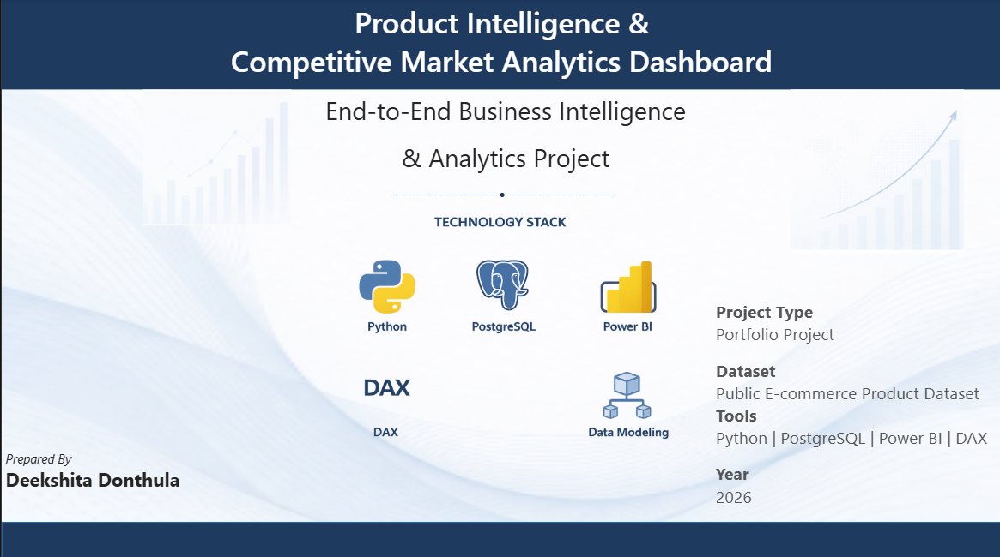
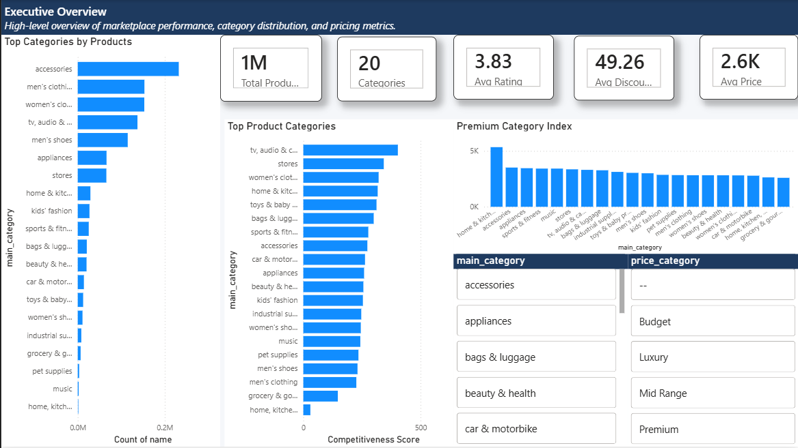
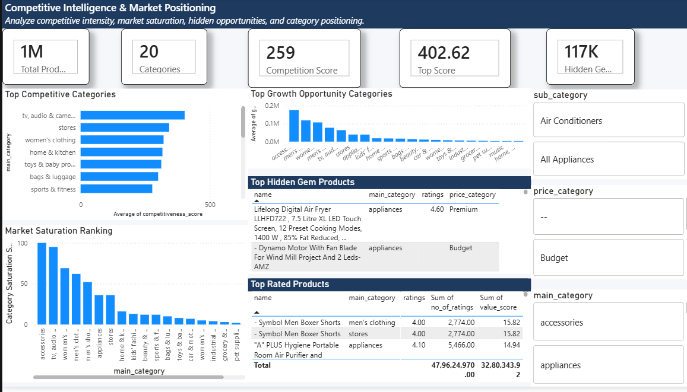
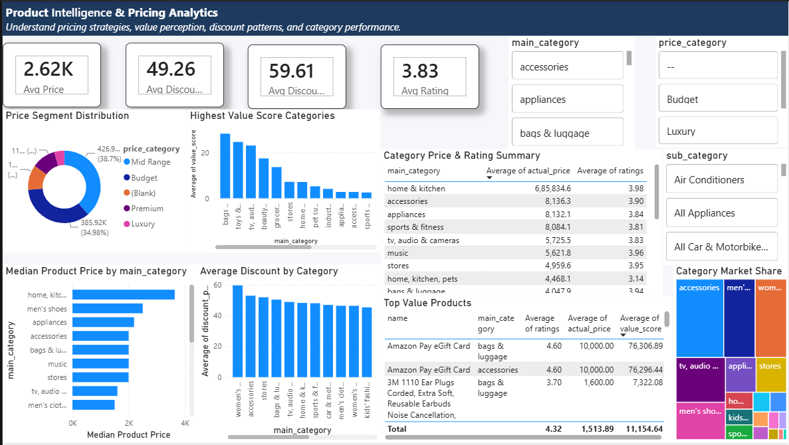
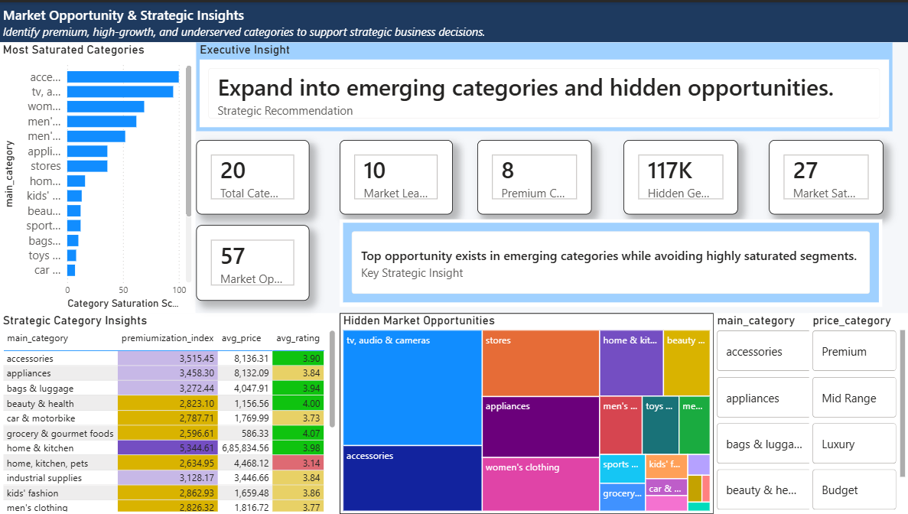

# 📊 Product Intelligence & Competitive Market Analytics Dashboard

> ### 🚀 End-to-End Business Intelligence & Analytics Project
>
> A comprehensive analytics solution built using **Python, PostgreSQL, SQL, Power BI, and DAX** to analyze **product competitiveness, pricing strategies, market saturation, customer value perception, and hidden business opportunities**. The project demonstrates the complete analytics lifecycle—from **data preprocessing and ETL** to **interactive business intelligence dashboards** that support strategic decision-making.

---

## 📌 Project Summary

| Category | Details |
|-----------|---------|
| **Project Type** | End-to-End Business Intelligence & Analytics Project |
| **Domain** | E-Commerce Product Intelligence & Competitive Market Analytics |
| **Dataset** | Public Amazon Product Dataset |
| **Dataset Size** | 412,000+ Products |
| **Product Categories** | 20 Main Categories |
| **Technology Stack** | Python, PostgreSQL, SQL, Power BI, DAX |
| **Dashboard Pages** | 5 Interactive Dashboards |
| **Database** | PostgreSQL |
| **Project Focus** | Product Intelligence, Competitive Analysis, Pricing Analytics, Market Opportunity Identification |

## 🌟 Project Highlights

- ✅ Built a complete ETL pipeline using **Python**.
- ✅ Designed an analytical database in **PostgreSQL**.
- ✅ Developed reusable SQL views for business reporting.
- ✅ Created interactive **Power BI dashboards** with DAX measures.
- ✅ Performed pricing, competitiveness, and market opportunity analysis.
- ✅ Identified hidden growth opportunities and premium product segments.
- ✅ Delivered strategic business insights to support executive decision-making.

## 📑 Table of Contents

- [📌 Project Overview](#-project-overview)
- [📸 Dashboard Preview](#-dashboard-preview)
- [📖 About the Project](#-about-the-project)
- [💼 Business Problem](#-business-problem)
- [❓ Business Questions Answered](#-business-questions-answered)
- [🎯 Project Objectives](#-project-objectives)
- [🛠 Technology Stack](#-technology-stack)
- [⚙ Project Workflow](#-project-workflow)
- [🏗 Project Architecture](#-project-architecture)
- [📊 Dataset Overview](#-dataset-overview)
- [🔄 ETL Pipeline](#-etl-pipeline)
- [🗄 Database Design](#-database-design)
- [📈 Dashboard Overview](#-dashboard-overview)
- [💡 Key Business Insights](#-key-business-insights)
- [📂 Repository Structure](#-repository-structure)
- [🚀 Installation Guide](#-installation-guide)
- [🔮 Future Enhancements](#-future-enhancements)
- [🧠 Key Skills Demonstrated](#-key-skills-demonstrated)
- [📚 Documentation](#-documentation)
- [👩‍💻 Author](#-author)

# 📌 Project Overview

The **Product Intelligence & Competitive Market Analytics Dashboard** is an end-to-end Business Intelligence project developed to transform raw e-commerce product data into meaningful business insights.

The project combines **Python**, **PostgreSQL**, **SQL**, **Power BI**, and **DAX** to build a complete analytics solution capable of evaluating product competitiveness, pricing strategies, category performance, market saturation, and hidden growth opportunities.

Starting from a large public Amazon product dataset, the project demonstrates the complete analytics lifecycle including:

- Data Cleaning & Transformation
- Feature Engineering
- ETL Pipeline Development
- Relational Database Design
- SQL-Based Analytical Modeling
- Interactive Dashboard Development
- Business Insight Generation

The final solution enables stakeholders to monitor marketplace performance, identify high-value product categories, evaluate competitive positioning, optimize pricing strategies, and support strategic business decision-making through interactive dashboards.

# 📸 Dashboard Preview

The Power BI report consists of **five interactive dashboard pages**, each focusing on a different aspect of marketplace analytics.

---

## 1️⃣ Cover Page

Introduces the project, technology stack, and analytics objective.

---

## 2️⃣ Executive Overview

Provides a high-level summary of marketplace performance through KPIs, category distribution, competitiveness score, pricing metrics, and interactive filters.

---

## 3️⃣ Competitive Intelligence & Market Positioning

Analyzes category competitiveness, hidden opportunities, market saturation, top-performing products, and competitive positioning.

---

## 4️⃣ Product Intelligence & Pricing Analytics

Focuses on pricing behaviour, value perception, discounts, premium segments, category pricing, and product performance.

---

## 5️⃣ Market Opportunity & Strategic Insights

Transforms analytical findings into executive recommendations by identifying growth opportunities, premium markets, hidden gems, and strategic investment areas.

# 📖 About the Project

Modern e-commerce marketplaces contain millions of products competing across hundreds of categories, making it difficult for businesses to identify profitable opportunities and make informed pricing decisions.

This project was developed to simulate how an analytics team can transform raw marketplace data into actionable business intelligence using modern data engineering and visualization tools.

The solution follows an end-to-end analytics workflow beginning with data preprocessing in Python, followed by data warehousing in PostgreSQL, SQL-based analytical modeling, and interactive dashboard development in Power BI.

Rather than simply displaying charts, the project focuses on answering real business questions related to market competitiveness, pricing strategy, category performance, customer value perception, and strategic growth opportunities.

The resulting dashboard enables decision-makers to move beyond descriptive reporting and make data-driven strategic decisions.

# 💼 Business Problem

Businesses operating in large online marketplaces often face significant challenges when evaluating product performance and competitive positioning.

Without a centralized analytics platform, organizations struggle to:

- Monitor competition across multiple product categories.
- Identify saturated markets with intense competition.
- Discover emerging categories with growth potential.
- Evaluate pricing strategies across different market segments.
- Identify high-value products offering strong customer satisfaction.
- Support executive decision-making with reliable business insights.

As marketplaces continue to expand, manually analyzing thousands of products becomes increasingly difficult. Organizations require a scalable Business Intelligence solution capable of transforming raw product data into actionable strategic insights.

This project addresses these challenges by providing a comprehensive Product Intelligence and Competitive Market Analytics Dashboard.

# ❓ Business Questions Answered

This project is designed to answer several important business questions, including:

- Which product categories are the most competitive?
- Which categories have the highest market saturation?
- Where are the hidden market opportunities?
- Which products provide the highest value to customers?
- Which categories demonstrate premium pricing power?
- How do discounts vary across different product categories?
- Which categories combine high ratings with competitive pricing?
- Which product segments offer the greatest business potential?
- Where should businesses focus future investments?
- How can pricing strategies be optimized using marketplace insights?
